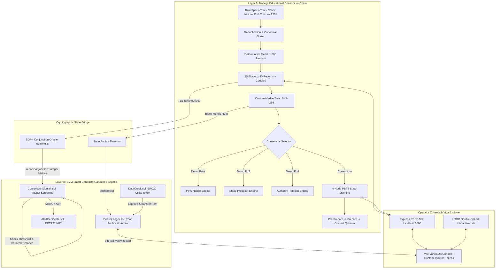

# Orbit Ledger: Technical Requirements Document (TRD)

## 1. System Overview and Architecture

Orbit Ledger is structured into two distinct operational layers linked cryptographically through state anchoring:

1. Layer A (Consortium Orbit Chain): A pure Node.js distributed ledger simulating four satellite operator nodes. It implements block creation, SHA-256 cryptographic linking, custom Merkle tree generation, and selectable consensus models (PoW, PoS, PoA, and a 4-node PBFT protocol with Byzantine fault injection).
2. Layer B (Ethereum Smart Contracts): A suite of four Solidity 0.8.24 contracts deployed to Ganache and Sepolia. Layer B provides immutable root anchoring, on-chain Merkle proof verification, ERC20 data credit payments, and automated conjunction screening producing ERC721 safety certificates.

### 1.1 Architectural Diagram



## 2. Module Boundaries

The project enforces strict separation of concerns across four logical packages:

1. `chain/` (Layer A Core):
   - `block.js`: Block header data structure, serialization, and block hash generation.
   - `merkle.js`: Custom Merkle tree builder, root calculator, and proof generator using SHA-256.
   - `blockchain.js`: Chain validation, state transitions, JSON flat-file storage, and duplicate filtering.
   - `consensus/`: PoW mining worker, PoS slot selector, PoA validator schedule, and PBFT node simulator.
   - `utxo/`: Standalone UTXO ledger, transaction validator, and double-spending detection engine.
2. `contracts/` (Layer B EVM Smart Contracts):
   - `DataCredit.sol`: OpenZeppelin ERC20 token for data access compensation.
   - `AlertCertificate.sol`: OpenZeppelin ERC721 token for verified close-approach alerts.
   - `DebrisLedger.sol`: Root anchoring storage, on-chain SHA-256 Merkle proof verifier, and access rights escrow.
   - `ConjunctionMonitor.sol`: Integer coordinate distance calculation, squared threshold comparison, and duplicate alert prevention.
3. `server/` (API and Oracle Services):
   - `api.js`: Express REST API exposing Layer A state, PBFT triggers, and UTXO simulation.
   - `oracle.js`: SGP4 propagation service calculating object positions using `satellite.js` and submitting candidate conjunctions to Layer B.
   - `seed.js`: Deterministic dataset processor parsing raw Space-Track CSVs into reproducible chain blocks.
4. `frontend/` (User Interface):
   - Vite single-page application written in vanilla JavaScript with a client-side hash router.
   - Styled with Tailwind CSS configured with restricted tokens from `UI_SPEC.md`.

## 3. Data Model and Storage Specifications

### 3.1 Orbital Record Specification

Each orbital record represents a canonical space object state at a designated epoch:

```json
{
  "recordId": "IRIDIUM-33-34376-2026-07-01T00:05:44.655Z",
  "noradCatId": 34376,
  "objectName": "IRIDIUM 33 DEB",
  "objectId": "1997-051FU",
  "operator": "Node-1-Alpha",
  "epoch": "2026-07-01T00:05:44.655Z",
  "inclinationDeg": 86.2946,
  "semimajorAxisKm": 7051.195,
  "eccentricity": 0.0024351,
  "periodMin": 98.21,
  "apoapsisKm": 690.23,
  "periapsisKm": 655.89,
  "tleLine1": "1 34376U 97051FU  26182.00398907  .00011516  00000-0  20759-2 0  9999",
  "tleLine2": "2 34376  86.2946 276.1756 0024351 202.9632 157.0495 14.66252219909381",
  "recordHash": "a1b2c3...64 hex characters..."
}
```

Canonical Record Hashing Formula:
To ensure determinism across platforms, `recordHash` is derived by concatenating the fields in strict alphabetical order with newline separators and taking the SHA-256 digest:

```javascript
const payload = [
  record.noradCatId,
  record.objectId,
  record.epoch,
  record.inclinationDeg.toFixed(4),
  record.semimajorAxisKm.toFixed(3),
  record.eccentricity.toFixed(7),
  record.tleLine1.trim(),
  record.tleLine2.trim()
].join('|');

const recordHash = crypto.createHash('sha256').update(payload, 'utf8').digest('hex');
```

### 3.2 Block Data Specification

Layer A blocks contain a cryptographic header and an array of records:

```json
{
  "header": {
    "index": 1,
    "previousHash": "0000000000000000000000000000000000000000000000000000000000000000",
    "timestamp": 1782864080,
    "merkleRoot": "e3b0c44298fc1c149afbf4c8996fb92427ae41e4649b934ca495991b7852b855",
    "consensus": "PBFT",
    "proposer": "Node-1-Alpha",
    "difficulty": 0,
    "nonce": 0,
    "blockHash": "5f4dcc3b5aa765d61d8327deb882cf992b96decac5592e3d778d2b8b939fa991"
  },
  "records": [
    { "...": "40 orbital records" }
  ]
}
```

Block Hashing Formula:
```javascript
const headerString = [
  header.index,
  header.previousHash,
  header.timestamp,
  header.merkleRoot,
  header.consensus,
  header.proposer,
  header.difficulty,
  header.nonce
].join(':');

const blockHash = crypto.createHash('sha256').update(headerString, 'utf8').digest('hex');
```

### 3.3 Genesis Block Specification (Block 0)

Block 0 is fixed deterministically:
- `index`: 0
- `previousHash`: `0000000000000000000000000000000000000000000000000000000000000000` (64 zeros)
- `timestamp`: 1782777600 (2026-07-01T00:00:00.000Z)
- `records`: 1 genesis sentinel record defining the consortium charter and member public keys
- `merkleRoot`: Computed from the genesis sentinel record
- `consensus`: `GENESIS`
- `proposer`: `CONSORTIUM_ROOT`
- `difficulty`: 0
- `nonce`: 0

## 4. Hashing and Merkle Tree Rules

### 4.1 SHA-256 versus Keccak-256 Rationale

The syllabus requires students to analyze cryptographic hashing primitives and understand why different blockchains utilize distinct functions.
- SHA-256 (Secure Hash Algorithm 2): Designed by the NSA and published by NIST in FIPS 180-4. Employs the Merkle-Damgard construction with a 512-bit message block and 64 rounds of compression. Bitcoin standardized on double SHA-256 (`hash256 = sha256(sha256(m))`) to mitigate length extension attacks.
- Keccak-256: Developed by Guido Bertoni, Joan Daemen, Michael Peeters, and Gilles Van Assche. Won the NIST SHA-3 competition in 2012. Employs the Sponge construction with permutation function keccak-f[1600]. Ethereum adopted a pre-standardization version of Keccak-256 in 2014 before NIST finalized FIPS 202 with slightly altered padding bytes (0x01 in Ethereum Keccak versus 0x06 in NIST SHA-3).

Architectural Decision:
Layer A uses standard NIST SHA-256 because it is universal, matches Bitcoin fundamentals (Module 2), and aligns directly with the EVM precompile at address `0x02` (Solidity `sha256()`). We do not use keccak256 for Layer A records to avoid hybrid algorithm confusion. OpenZeppelin's `MerkleProof.sol` is avoided because it hardcodes `keccak256()`. Our custom `verifyRecord()` function in `DebrisLedger.sol` calls `sha256()` directly.

### 4.2 Exact Leaf and Pair Ordering Rules

To ensure an off-chain JavaScript Merkle proof verifies identically inside an EVM contract, leaf and pair calculations adhere to this exact specification:

1. Leaf Representation:
   - Given a 64-character hex `recordHash`, convert it to a 32-byte Buffer: `leaf = Buffer.from(recordHash, 'hex')`.
2. Odd Leaf Count Balancing:
   - If a layer has an odd number of nodes, the last node is duplicated to form a complete pair: `nodes.push(nodes[nodes.length - 1])` (matching Bitcoin standard Merkle tree behavior).
3. Pair Hashing Byte Layout:
   - For an adjacent pair of 32-byte hashes `(left, right)`:
   - The 64-byte payload is formed by appending `right` directly to `left`: `Buffer.concat([left, right])`.
   - Node.js calculation: `crypto.createHash('sha256').update(Buffer.concat([left, right])).digest()`.
   - Solidity calculation: `sha256(abi.encodePacked(left, right))`.
4. Merkle Proof Structure:
   - A proof consists of an array of 32-byte sibling hashes (`bytes32[] proof`) and the leaf index (`uint256 leafIndex`).
   - For level `k` in the tree:
     - `bit = (leafIndex >> k) & 1`
     - If `bit == 0`, the current running hash is the left child, and sibling is the right child: `current = sha256(abi.encodePacked(current, proof[k]))`.
     - If `bit == 1`, the current running hash is the right child, and sibling is the left child: `current = sha256(abi.encodePacked(proof[k], current))`.
   - After processing all levels, the proof is valid if and only if `current == anchoredRoot`.

## 5. Consensus Specifications

### 5.1 Proof-of-Work (PoW)

- Objective: Demonstrate Nakamoto consensus principles from Module 2.
- Mechanism: A candidate block header is repeatedly hashed with an incrementing 32-bit `nonce` until the hex digest begins with `difficulty` leading zeros.
- Target Rule: `blockHash.startsWith("0".repeat(difficulty))`.
- Demo Settings:
  - Difficulty 1: Target `0...` (average 16 hashes, less than 10 ms).
  - Difficulty 2: Target `00...` (average 256 hashes, less than 50 ms).
  - Difficulty 3: Target `000...` (average 4,096 hashes, 100 to 500 ms).
  - Difficulty 4: Target `0000...` (average 65,536 hashes, 1 to 3 seconds).
- Metrics Exposed to UI: Nonce iterations, elapsed time (ms), and instantaneous hash rate (h/s).

### 5.2 Proof-of-Stake (PoS)

- Objective: Demonstrate slot-based validator selection proportional to token stake.
- Validator Staking Distribution:
  - Operator 1 (Node Alpha): 40,000 ODC (40%)
  - Operator 2 (Node Beta): 30,000 ODC (30%)
  - Operator 3 (Node Gamma): 20,000 ODC (20%)
  - Operator 4 (Node Delta): 10,000 ODC (10%)
- Proposer Selection Algorithm:
  - Input: `seed = sha256(previousBlockHash + slotNumber)`.
  - Convert `seed` to an integer modulo total stake (100,000).
  - Walk cumulative stake thresholds to pick the designated proposer.
  - UI displays the slot lottery selection, proving stake-weighted probability.

### 5.3 Proof-of-Authority (PoA)

- Objective: Demonstrate authorized consortium rotation (Clique/Aura style).
- Mechanism: An ordered list of four authorized operator public keys: `[Alpha, Beta, Gamma, Delta]`.
- Proposer Rule: `designatedProposer = authorizedNodes[blockIndex % authorizedNodes.length]`.
- Validation: Block proposal must be signed with the designated proposer private key. Non-authorized proposals are immediately rejected.

### 5.4 4-Node Practical Byzantine Fault Tolerance (PBFT)

- Objective: Implement Castro and Liskov's PBFT state machine for Module 4 consortium blockchains.
- System Parameters:
  - Node count: `R = 4`.
  - Tolerated Byzantine faults: `f = (R - 1) / 3 = (4 - 1) / 3 = 1`.
  - Quorum threshold: `2f + 1 = 2(1) + 1 = 3` nodes.
- Message Flow:
  1. Request: Client/Operator submits a candidate batch of orbital records.
  2. Pre-Prepare: Primary node (determined by `viewNumber % 4`) assigns sequence number `n` and broadcasts `<PRE-PREPARE, view, n, blockHash, proposerSignature>`.
  3. Prepare: Each node verifies the primary signature and block hash, logs the proposal, and broadcasts `<PREPARE, view, n, blockHash, node_i>`.
  4. Prepared State: When a node collects `2f = 2` matching prepare messages from distinct peers (plus its own, making `2f + 1 = 3`), it enters the Prepared state.
  5. Commit: Nodes in the prepared state broadcast `<COMMIT, view, n, blockHash, node_i>`.
  6. Committed State: When a node collects `2f + 1 = 3` matching commit messages, it commits the block to its local ledger and replies to the client.
- In-Process Simulation Architecture:
  - Four distinct `PBFTNode` instances running within the Express process.
  - An event-based virtual network bus (`VirtualNetwork`) modeling message passing, latency, and fault injection.
- Fault Injection Scenarios:
  - Scenario 0 (All Honest): 4 nodes participate. Block commits with 4/4 unanimous votes.
  - Scenario 1 (Single Fault, f = 1): Node 4 is toggled offline or instructed to sign conflicting hashes. Nodes 1, 2, and 3 exchange messages, collect 3 votes in prepare and commit phases, reach the `2f + 1 = 3` quorum, and successfully commit the block. The UI displays that consensus was maintained despite 1 Byzantine node.
  - Scenario 2 (Double Fault, f = 2): Nodes 3 and 4 are toggled offline or corrupted. Nodes 1 and 2 only achieve 2 votes. Quorum of 3 is unreachable. The protocol halts safely, preventing a split-brain fork. The UI explains why 3f + 1 requires at least 3 nodes to tolerate 1 failure.

## 6. Smart Contract Specifications (Layer B)

The EVM smart contract layer comprises four Solidity 0.8.24 contracts using OpenZeppelin Contracts v5.0.

### 6.1 `DataCredit.sol` (ERC20)

- Base: OpenZeppelin `ERC20`, `Ownable`.
- Name: `Orbit Data Credit`
- Symbol: `ODC`
- Decimals: 18
- Initial Supply: 1,000,000 ODC minted to deployer for distribution across simulated operator wallets.
- Key Functions:
  - `mint(address to, uint256 amount) external onlyOwner`: Allocates demo tokens.
  - Standard ERC20 `transfer`, `approve`, `transferFrom`.

### 6.2 `AlertCertificate.sol` (ERC721)

- Base: OpenZeppelin `ERC721Enumerable`, `Ownable`.
- Name: `Orbit Conjunction Certificate`
- Symbol: `OCC`
- Struct `Certificate`:
  ```solidity
  struct Certificate {
      uint256 object1Id;
      uint256 object2Id;
      uint256 epoch;
      uint256 missDistanceMetres;
      uint256 thresholdMetres;
      address reportingOperator;
      uint256 timestamp;
  }
  ```
- Storage:
  - `mapping(uint256 => Certificate) public certificates;`
  - `address public conjunctionMonitorContract;`
- Key Functions:
  - `setMonitorContract(address _monitor) external onlyOwner`
  - `mintCertificate(address to, uint256 obj1, uint256 obj2, uint256 epoch, uint256 missDistance, uint256 threshold) external returns (uint256)`: Restricted to `conjunctionMonitorContract`. Emits `CertificateMinted(tokenId, obj1, obj2, missDistance)`.

### 6.3 `DebrisLedger.sol`

- Base: `Ownable`.
- Struct `BlockAnchor`:
  ```solidity
  struct BlockAnchor {
      bytes32 merkleRoot;
      uint256 recordCount;
      uint256 blockTimestamp;
      uint256 anchoredAt;
      address anchoredBy;
  }
  ```
- Storage:
  - `mapping(uint256 => BlockAnchor) public anchors;`
  - `mapping(address => bool) public authorizedOperators;`
  - `mapping(uint256 => mapping(address => bool)) public blockAccess;`
  - `IERC20 public dataCreditToken;`
  - `uint256 public accessFee;` (for example, 100 ODC)
- Custom Errors:
  - `UnauthorizedOperator()`
  - `BlockAlreadyAnchored(uint256 blockIndex)`
  - `BlockNotAnchored(uint256 blockIndex)`
  - `InvalidMerkleProof()`
  - `PaymentFailed()`
- Key Functions:
  - `setOperator(address operator, bool authorized) external onlyOwner`
  - `anchorRoot(uint256 blockIndex, bytes32 root, uint256 recordCount, uint256 blockTimestamp) external`: Restricted to authorized operators. Emits `RootAnchored(blockIndex, root, recordCount, blockTimestamp, msg.sender)`.
  - `verifyRecord(uint256 blockIndex, bytes32 leafHash, bytes32[] calldata proof, uint256 leafIndex) external view returns (bool)`: Computes running SHA-256 hashes using EVM `sha256()`. Reverts with `BlockNotAnchored` if anchor missing; returns boolean verification result.
  - `buyAccess(uint256 blockIndex, address publisher) external`: Transfers `accessFee` from `msg.sender` to `publisher` via `dataCreditToken.transferFrom`. Sets `blockAccess[blockIndex][msg.sender] = true`. Emits `AccessPurchased(blockIndex, msg.sender, publisher)`.

### 6.4 `ConjunctionMonitor.sol`

- Base: `Ownable`.
- Struct `ConjunctionAlert`:
  ```solidity
  struct ConjunctionAlert {
      uint256 object1Id;
      uint256 object2Id;
      uint256 epoch;
      uint256 missDistanceMetres;
      uint256 thresholdMetres;
      uint256 timestamp;
      address reportedBy;
      uint256 certificateTokenId;
  }
  ```
- Storage:
  - `uint256 public squaredThresholdMetres;` (e.g. 5,000,000 m squared = 25,000,000,000,000)
  - `mapping(bytes32 => ConjunctionAlert) public alerts;`
  - `IAlertCertificate public certificateContract;`
  - `mapping(address => bool) public authorizedOracles;`
- Custom Errors:
  - `UnauthorizedOracle()`
  - `ConjunctionAlreadyReported(bytes32 pairEpochHash)`
  - `DistanceExceedsThreshold(uint256 distanceSquared, uint256 thresholdSquared)`
- Logic and Integer Arithmetic:
  ```solidity
  function reportConjunction(
      uint256 obj1,
      uint256 obj2,
      uint256 epoch,
      int64[3] calldata pos1,
      int64[3] calldata pos2
  ) external returns (bytes32 alertId, uint256 tokenId) {
      if (!authorizedOracles[msg.sender]) revert UnauthorizedOracle();
      
      bytes32 pairEpochHash = keccak256(abi.encodePacked(
          obj1 < obj2 ? obj1 : obj2,
          obj1 < obj2 ? obj2 : obj1,
          epoch
      ));
      if (alerts[pairEpochHash].timestamp != 0) revert ConjunctionAlreadyReported(pairEpochHash);

      int256 dx = int256(pos1[0]) - int256(pos2[0]);
      int256 dy = int256(pos1[1]) - int256(pos2[1]);
      int256 dz = int256(pos1[2]) - int256(pos2[2]);

      uint256 distSquared = uint256(dx * dx + dy * dy + dz * dz);
      if (distSquared > squaredThresholdMetres) revert DistanceExceedsThreshold(distSquared, squaredThresholdMetres);

      uint256 missDistanceMetres = sqrt(distSquared);
      tokenId = certificateContract.mintCertificate(msg.sender, obj1, obj2, epoch, missDistanceMetres, sqrt(squaredThresholdMetres));

      alerts[pairEpochHash] = ConjunctionAlert({
          object1Id: obj1,
          object2Id: obj2,
          epoch: epoch,
          missDistanceMetres: missDistanceMetres,
          thresholdMetres: sqrt(squaredThresholdMetres),
          timestamp: block.timestamp,
          reportedBy: msg.sender,
          certificateTokenId: tokenId
      });

      emit ConjunctionDetected(pairEpochHash, obj1, obj2, missDistanceMetres, tokenId);
      return (pairEpochHash, tokenId);
  }
  ```

## 7. Data Ingestion, Deduplication, and Subset Justification

### 7.1 Data Subset Rationale

The raw Space-Track exports provided contain:
- `iridium_33_july2026.csv`: 4,920 rows, 111 unique NORAD IDs, 741 duplicate (NORAD_CAT_ID, EPOCH) pairs, 4,179 unique pairs.
- `cosmos_2251_july2026.csv`: 25,653 rows, 601 unique NORAD IDs, 3,978 duplicate pairs, 21,675 unique pairs.
- Total raw rows: 30,573 rows.

Loading 30,000 orbital records into an in-memory educational blockchain would bloat JSON storage (over 50 MB), slow down API deserialization, and lengthen unit test execution. A subset of 1,000 records partitioned into 25 blocks of 40 records satisfies all instructional goals:
1. Balanced Representation: Exactly 500 Iridium 33 records (100 unique fragments) and 500 Cosmos 2251 records (293 unique fragments), providing two distinct orbital clusters (86.3° versus 74.05° inclination).
2. Clean Chronological Epoch Window: Spans from 2026-07-01T00:01:20 UTC to 2026-07-04T05:22:14 UTC.
3. Realistic Density: 40 records per block simulates a realistic multi-satellite batch publication.
4. Preserved Duplicate Fixtures: 20 raw duplicate records separated during preprocessing are stored in `test/fixtures/duplicates_demo.json` to prove in live tests that submitting an existing (object, epoch) pair is rejected by Layer A.

## 8. SGP4 Propagation and Conjunction Screening Realism

### 8.1 Realism Boundary

Two-Line Element sets (TLEs) propagated using SGP4 models describe mean orbital elements. In operational astrodynamics, TLEs possess position errors on the order of 1 to 5 kilometres. Furthermore, Iridium 33 fragments (86.3° inclination) and Cosmos 2251 fragments (74.05° inclination) orbit in distinct planes, meaning genuine close approaches within 1 kilometre are infrequent.

To preserve scientific integrity:
1. Screening Distinction: The documentation and UI prominently label this system as a Conjunction Screening Demo, not an operational collision avoidance system.
2. Configurable Threshold: The default screening threshold is configurable (defaulting to 50 km or 100 km for broad screening, or calibrated to specific intersecting geometry).
3. Integer Precision: Position vectors are derived in metres as 64-bit signed integers:
   `pos = [Math.round(x_km * 1000), Math.round(y_km * 1000), Math.round(z_km * 1000)]`.
   This allows the smart contract to perform exact integer arithmetic without floating-point inaccuracies.

## 9. API Specifications

The Express API serves Layer A state, runs the consensus simulations, and bridges to Layer B.

| Method | Endpoint | Description |
|---|---|---|
| `GET` | `/api/status` | Returns node health, chain height, consensus mode, active operators, anchored roots. |
| `GET` | `/api/blocks` | Returns block list with pagination (`page`, `limit`). |
| `GET` | `/api/blocks/:index` | Returns full block details including all 40 records and Merkle root. |
| `GET` | `/api/blocks/:index/proof/:recordIndex` | Returns sibling proof path and leaf hash for a specific record. |
| `POST` | `/api/mine` | Triggers PoW mining on pending records with requested difficulty. |
| `POST` | `/api/consensus/pbft/step` | Executes a PBFT consensus round with current fault injection parameters. |
| `POST` | `/api/consensus/pbft/faults` | Updates simulated node faults (e.g. `nodeId: 4, fault: "offline"`). |
| `GET` | `/api/conjunctions/screen` | Runs SGP4 screening over current epoch window, returning candidate pairs. |
| `POST` | `/api/conjunctions/report` | Submits candidate pair to `ConjunctionMonitor.sol` via oracle wallet. |
| `POST` | `/api/utxo/submit` | Submits a transaction to the standalone UTXO pool. |
| `GET` | `/api/utxo/pool` | Returns current unspent transaction outputs. |

## 10. Technology Stack and Dependency Justification

1. Node.js LTS v20.20.2: Pinned in `.nvmrc` and `package.json` `engines`. Supported by Ganache v7.9.2, Hardhat v2.22, and Vite v5. Avoids Node 24 native module compilation incompatibilities with Ganache's uWS layer.
2. Ethers.js v6.13: Current official Ethereum interaction library. Exclusively uses v6 syntax (`ethers.JsonRpcProvider`, `ethers.Contract`, `ethers.parseUnits`, `contract.waitForDeployment()`).
3. Hardhat v2.22: Standard Solidity development environment. Paired with `@nomicfoundation/hardhat-ethers` and OpenZeppelin Contracts v5.0. Configured with Solidity 0.8.24 and `evmVersion: "shanghai"`.
4. Ganache v7.9.2: Local EVM developer chain required by syllabus Module 3. Configured with 10 pre-funded accounts and network ID 1337.
5. Tailwind CSS v3.4: Pinned utility CSS compiler using custom palette variables defined in `UI_SPEC.md` to prevent generic kit appearance.
6. `satellite.js` v5.0: Standard astrodynamics library providing validated SGP4 propagation from TLE lines.
7. `csv-parse` v5.5: Streaming CSV parser handling space-separated and quoted fields in Space-Track exports.
8. Native Node.js `crypto`: Standard library implementation of SHA-256 for Layer A blocks and Merkle trees.

## 11. Project Directory Structure

```
orbit-ledger/
├── .nvmrc                         # Pin node v20.20.2
├── package.json                   # Scripts, engines, dependencies
├── hardhat.config.js              # Hardhat configuration (Ganache & Sepolia)
├── contracts/                     # Layer B Solidity Smart Contracts
│   ├── DataCredit.sol
│   ├── AlertCertificate.sol
│   ├── DebrisLedger.sol
│   └── ConjunctionMonitor.sol
├── chain/                         # Layer A Custom Blockchain Core
│   ├── block.js
│   ├── merkle.js
│   ├── blockchain.js
│   ├── consensus/
│   │   ├── pow.js
│   │   ├── pos.js
│   │   ├── poa.js
│   │   └── pbft.js
│   └── utxo/
│       └── utxo_ledger.js
├── server/                        # API & Oracle Services
│   ├── api.js
│   ├── oracle.js
│   └── seed.js
├── frontend/                      # Vanilla JS + Tailwind Front-End
│   ├── index.html
│   ├── package.json
│   ├── vite.config.js
│   ├── tailwind.config.js
│   ├── src/
│   │   ├── main.js
│   │   ├── router.js
│   │   ├── styles.css
│   │   ├── api.js
│   │   ├── pages/
│   │   └── components/
│   └── public/
│       └── fonts/                 # Self-hosted IBM Plex Sans & Mono
├── data/                          # Processed data & fixtures
│   ├── seed_records.json
│   └── duplicates_demo.json
├── test/                          # Automated Test Suites
│   ├── chain/                     # node:test unit tests for Layer A
│   └── contracts/                 # Hardhat Mocha/Chai tests for Layer B
├── scripts/                       # Deployment, Preflight & Demo automation
│   ├── deploy.js
│   ├── seed_chain.js
│   ├── preflight.js
│   └── demo_e2e.js
└── docs/                          # Project Specifications & Viva Pack
    ├── PRD.md
    ├── TRD.md
    ├── UI_SPEC.md
    ├── SYLLABUS_MAP.md
    ├── TEST_PLAN.md
    ├── DEPLOYMENT.md
    ├── TASKS.md
    └── PRESENTATION.md
```
